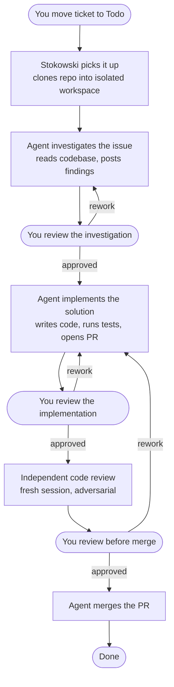
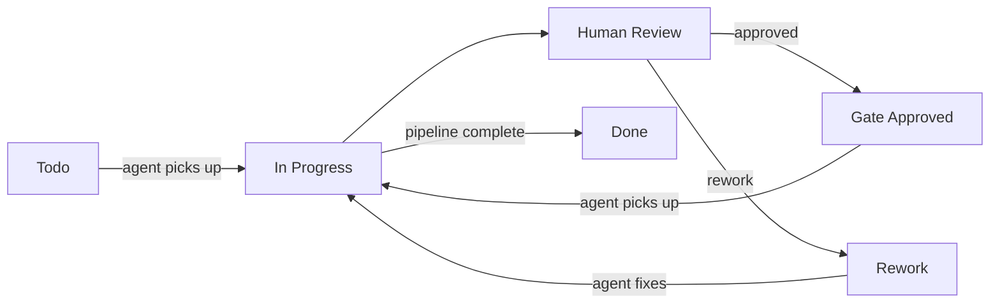

<div align="center">

# Stokowski

**Autonomous coding agents, orchestrated by Linear issues.**

Built on [OpenAI's Symphony](https://github.com/openai/symphony) spec and taken further — with configurable state machines, gate-based human review, multi-runner support, and a live web dashboard. Works with [Claude Code](https://claude.ai/claude-code), [Codex](https://openai.com/index/introducing-codex/), and [Linear](https://linear.app).

[](https://www.python.org/downloads/)
[](LICENSE)
[](https://claude.ai/claude-code)
[](https://linear.app)
[](https://github.com/openai/symphony)

*Named after Leopold Stokowski — the conductor who brought orchestral music to the masses.*

<br>


</div>

---

## Table of contents

- [What it actually does](#what-it-actually-does)
- [How is this different from Emdash?](#how-is-this-different-from-emdash)
- [What is it?](#what-is-it)
- [Features](#features)
- [What Stokowski adds beyond Symphony](#what-stokowski-adds-beyond-symphony)
- [Setup guide](#setup-guide)
  - [1. Install prerequisites](#1-install-prerequisites)
  - [2. Install Stokowski](#2-install-stokowski)
  - [3. Get your Linear API key](#3-get-your-linear-api-key)
  - [4. Set up Linear workflow states](#4-set-up-linear-workflow-states)
  - [5. Configure your workflow](#5-configure-your-workflow)
  - [6. Validate](#6-validate)
  - [7. Run](#7-run)
- [Configuration reference](#configuration-reference)
- [Prompt template variables](#prompt-template-variables)
- [MCP servers](#mcp-servers)
- [Writing good tickets for agents](#writing-good-tickets-for-agents)
- [Getting the most out of Stokowski](#getting-the-most-out-of-stokowski)
- [Architecture](#architecture)
- [Upgrading](#upgrading)
- [Security](#security)
- [License](#license)
- [Credits](#credits)

---

## What it actually does

You write a ticket in Linear. You move it to **Todo**. Stokowski picks it up and runs it through whatever workflow you've configured — agent stages, human review gates, rework loops, all defined in a single `workflow.yaml` file.

Here's an example workflow — investigate, implement, review, merge — with human gates between each stage:



This is just one example. The state machine is fully configurable — you define the states, transitions, gates, and rework targets. Want a single-stage workflow with no gates? A research loop that cycles until a human is satisfied? Different runners (Claude Code vs Codex) and models at each stage? All configurable in `workflow.yaml`.

Each agent runs in its own isolated git clone — multiple tickets can be worked in parallel without conflicts. Token usage, turn count, and last activity are tracked live in the terminal and web dashboard.

---

## How is this different from Emdash?

[Emdash](https://www.emdash.sh/) is a well-built open-source desktop app for running coding agents. It supports 22+ agent CLIs (Claude Code, Codex, Gemini, Cursor, and more) and integrates with Linear, Jira, and GitHub Issues. If you're evaluating both, here's an honest comparison.

**The core difference: autonomous daemon vs interactive GUI.**

Emdash is a developer-facing desktop app — you pick an issue, pick an agent, and launch it manually. It's excellent for interactive parallel agent work, especially if you want to switch between providers.

Stokowski is a headless daemon — it runs unattended, polling Linear for issues and autonomously dispatching agents through a configurable state machine. You define the workflow once, and issues flow through it without human intervention (except at review gates where you explicitly want it).

**The second difference: agent context separation.**

When you work interactively with Claude Code in your repo, you rely on `CLAUDE.md` and your project's rule files to guide Claude's behaviour. The problem with putting autonomous agent instructions in `CLAUDE.md` is that they bleed into your regular Claude Code sessions — your day-to-day interactive work now carries all the "you are running headlessly, never ask a human, follow this state machine" instructions that only make sense for an unattended agent.

Stokowski solves this with `workflow.yaml` and a `prompts/` directory. Your autonomous agent prompt — how to handle Linear states, what quality gates to run, how to structure PRs, what to do when blocked — lives entirely in your workflow config and is only injected into headless agent sessions. Your `CLAUDE.md` stays clean for interactive use.

```
Interactive session:    Claude reads CLAUDE.md              ← your normal instructions
Stokowski agent:        Claude reads CLAUDE.md               ← same conventions
                              +  workflow.yaml config        ← state machine + dispatch
                              +  prompts/ stage files        ← agent-only instructions
```

| | Stokowski | Emdash |
|---|---|---|
| Model | Autonomous daemon — polls Linear, dispatches agents, manages lifecycle | Interactive desktop app — human-initiated agent runs |
| Agent runners | Claude Code + Codex per state | 22+ agent CLIs (Claude Code, Codex, Gemini, Cursor, etc.) |
| State machine | Configurable stages, gates, transitions, rework loops | No workflow engine — single-shot agent runs |
| Human review gates | Built-in gate protocol with approve/rework Linear states | No gate protocol |
| Prompt assembly | Three-layer Jinja2 (global + stage + auto-injected lifecycle) | No custom prompt templates |
| Quality gate hooks | `before_run` / `after_run` / `on_stage_enter` shell scripts | Not available |
| Retry & recovery | Exponential backoff, stall detection, crash recovery from tracking comments | No retry logic |
| Issue trackers | Linear | Linear, Jira, GitHub Issues |
| MCP servers | Any `.mcp.json` in the workspace | MCP support |
| Concurrency control | Global + per-state limits | Parallel agents in worktrees |
| Cost | Your existing API subscriptions | Free / open source |
| Open source | Yes | Yes |

**When to choose Emdash:** You want an interactive GUI, need to switch between many agent providers, or work across multiple issue trackers. Great for hands-on development where you're actively steering agents.

**When to choose Stokowski:** You want a fully autonomous pipeline that runs unattended — issues go in, PRs come out. You need state machine workflows, human review gates, quality hooks, or want to keep agent instructions separate from your interactive `CLAUDE.md`.

---

## What is it?

[Symphony](https://github.com/openai/symphony) is OpenAI's open specification for autonomous coding agent orchestration: poll a tracker for issues, create isolated workspaces, run agents, manage multi-turn sessions, retry failures, and reconcile state. It ships with a Codex/Elixir reference implementation.

**Stokowski implements the same spec with multi-runner support.** Point it at your Linear project and git repo, and agents autonomously pick up issues, write code, run tests, open PRs, and move tickets through your workflow — all while you do other things.

Different states in the same pipeline can use different runners and models. Use Claude Code Opus for investigation, Sonnet for implementation, Codex for a second opinion on code review — all in the same run, configured per-state in `workflow.yaml`.

```
Linear issue → isolated git clone → agent (Claude or Codex) → PR + Human Review → merge
```

### How it maps to Symphony

| Symphony | Stokowski |
|----------|-----------|
| `codex app-server` JSON-RPC | `claude -p --output-format stream-json` or `codex --quiet` |
| `thread/start` → thread_id | First turn → `session_id` |
| `turn/start` on thread | `claude -p --resume <session_id>` |
| `approval_policy: never` | `--dangerously-skip-permissions` |
| `thread_sandbox` tools | `--allowedTools` list |
| Elixir/OTP supervision | Python asyncio task pool |

---

## Features

- **Configurable state machine** — define agent stages, human gates, and transitions in `workflow.yaml`; issues flow through your pipeline automatically
- **Multi-runner** — Claude Code and Codex in the same pipeline; different states can use different runners and models (e.g. Opus for investigation, Sonnet for implementation, Codex for review)
- **Three-layer prompt assembly** — global prompt + per-stage prompt + auto-injected lifecycle context; each layer is a Jinja2 template with full issue variables
- **Linear-driven dispatch** — polls for issues in configured states, dispatches agents with bounded concurrency
- **Session continuity** — multi-turn agent sessions via `--resume` (Claude Code); agents pick up where they left off
- **Isolated workspaces** — per-issue git clones so parallel agents never conflict
- **Lifecycle hooks** — `after_create`, `before_run`, `after_run`, `before_remove`, `on_stage_enter` shell scripts for setup, quality gates, and cleanup
- **Retry with backoff** — failed turns retry automatically with exponential backoff
- **State reconciliation** — running agents are stopped if their Linear issue moves to a terminal state mid-run
- **Web dashboard** — live view of agent status, token usage, and last activity at `localhost:<port>`
- **MCP-aware** — agents inherit `.mcp.json` from the workspace (Figma, Linear, iOS Simulator, Playwright, etc.)
- **Persistent terminal UI** — live status bar, single-key controls (`q` quit · `s` status · `r` refresh · `h` help)

---

## What Stokowski adds beyond Symphony

Symphony's spec defines the core loop: poll a tracker, dispatch agents into isolated workspaces, manage sessions, retry failures, reconcile state. Stokowski implements all of that and adds several layers on top:

<details>
<summary><strong>State machine workflows</strong></summary>

Symphony uses a flat model — issues are either active or terminal, and agents run until the issue moves to a done state. There's no concept of stages, gates, or transitions.

Stokowski adds a full state machine engine:
- **Typed states** — `agent` (runs a coding agent), `gate` (pauses for human review), `terminal` (issue complete)
- **Explicit transitions** — each state declares where to go on success, approval, or rework
- **Loops and cycles** — rework targets can point to any earlier state, not just the previous one
- **Gate protocol** — dedicated "Gate Approved" and "Rework" Linear states with `max_rework` limits and automatic escalation
- **Structured tracking** — state transitions persisted as HTML comments on Linear issues for crash recovery

</details>

<details>
<summary><strong>Multi-runner, multi-model</strong></summary>

Symphony is tightly coupled to Codex via its `app-server` JSON-RPC protocol. Stokowski supports multiple runners and models, configurable per state:
- **Claude Code** — `claude -p` with stream-json output and multi-turn `--resume`
- **Codex** — `codex --quiet` for independent second opinions
- **Per-state model overrides** — use Opus for investigation, Sonnet for implementation, Codex for adversarial review, all in the same pipeline
- **Runner-agnostic orchestration** — the state machine, retry logic, and hooks work identically regardless of which runner a state uses

</details>

<details>
<summary><strong>Multi-repo routing</strong></summary>

Symphony assumes one Linear project maps to one repo. Stokowski supports the team-affine pattern where a single Linear project spans multiple repositories (common for infrastructure teams, platform teams, or teams owning N microservices):

- **`repos:` registry in `workflow.yaml`** — declare each repo with `{name, label, clone_url, default, docker_image?}`. See `workflow.multi-repo.example.yaml` for a complete example without triage, or `workflow.multi-repo-triage.example.yaml` for automatic classification.
- **Label-driven routing** — tickets are routed to a repo by a `repo:<name>` Linear label, applied by a triage agent or by humans. The existing multi-workflow label convention extends naturally to the repo axis.
- **Backward compatible** — configs without a `repos:` section continue to work unchanged. A synthetic `_default` repo is created and hooks pass through the shell verbatim (no Jinja rendering), preserving existing credential-helper shell patterns.
- **Hybrid `docker_image` resolution** — stage-level override → repo-level default → platform default. Heterogeneous stacks (one Node repo, one Python repo) each pick up their toolchain image without forking the workflow.
- **Triage workflow support** — a workflow marked `triage: true` receives the repo list as `STOKOWSKI_REPOS_JSON` env var and applies `repo:*` labels automatically. See `prompts/triage.example.md`.
- **v1 caps at one repo per ticket** — tickets with multiple `repo:*` labels are rejected with a Linear comment (deduped across ticks). v2 multi-repo-per-ticket is on the roadmap.

</details>

<details>
<summary><strong>Multi-project orchestration</strong></summary>

One orchestrator process can poll N Linear projects by binding multiple `workflow.<project>.yml` files. Each file stays a complete self-contained config — no nested schema, no cross-file coupling. Invoke with a single file (legacy), a directory, a glob, or an explicit list:

```bash
stokowski workflow.yaml                 # single project (legacy, unchanged)
stokowski workflows/                    # directory → every *.yaml/.yml inside
stokowski 'workflow.*.yml'              # glob
stokowski workflow.a.yml workflow.b.yml # explicit list
```

**Or set it once via `.env`:**

```bash
# .env
STOKOWSKI_WORKFLOW_PATH=examples/multi-project/
```

Then just `stokowski`. `STOKOWSKI_WORKFLOW_PATH` accepts the same shapes (file, directory, glob). Precedence: CLI args > env var > auto-detect (`./workflow.yaml` / `./workflow.yml` / `./WORKFLOW.md`). See `.env.example` for the full set of supported variables.

Per-project isolation:
- Own `tracker.api_key` — per-project API keys are first-class.
- Own `linear_states`, `states`, `workflows`, `repos`, `hooks`, `workspace.root`, `docker.*`, `claude` defaults.
- Own `LinearClient` — one httpx client per project, closed together at shutdown.

Shared globals (first-file-wins, alphabetical-case-insensitive): `agent.max_concurrent_agents`, `server.port`. Shared global that reduces across files: `polling.interval_ms` (min wins). A broken edit to one project file does not stall healthy projects — per-file hot-reload with last-known-good preservation.

Every dispatch adds `STOKOWSKI_LINEAR_PROJECT_SLUG` to the agent subprocess env alongside `STOKOWSKI_ISSUE_IDENTIFIER`. The dashboard snapshot emits `project_slug` on every running/gates/retrying entry.

See `examples/multi-project/` for a worked two-file example with a README and `--dry-run` walkthrough.

</details>

<details>
<summary><strong>Three-layer prompt assembly</strong></summary>

Symphony renders a single Jinja2 template from `WORKFLOW.md`. Stokowski builds prompts from three layers:
- **Global prompt** — shared project context injected into every agent turn
- **Stage prompt** — per-state instructions (pure Markdown, no config in prompt files)
- **Lifecycle injection** — auto-generated section with issue metadata, rework context, recent Linear comments, and transition instructions

Prompt authors never need to write "move the issue to Human Review when done" — the lifecycle layer handles that based on the YAML config.

</details>

<details>
<summary><strong>Terminal experience</strong></summary>

- **Persistent command bar** — a live footer pinned at the bottom of the terminal showing agent count, token usage, and keyboard shortcuts; stays visible as logs scroll above it
- **Single-key controls** — `q` graceful shutdown · `s` status table · `r` force poll · `h` help. No Ctrl+C wrestling.
- **Graceful shutdown** — `q` kills all agent subprocesses by process group before exiting, so you don't bleed tokens on orphaned agents
- **Update check** — on launch, checks for new releases via the GitHub API and shows an indicator in the footer

</details>

<details>
<summary><strong>Web dashboard</strong></summary>

- Live dashboard built with FastAPI + vanilla JS (no page reloads)
- Agent cards: current state, turn count, token usage, last activity message, blinking live status pill
- Pending gates view showing issues waiting for human review
- Aggregate metrics: total tokens used, uptime, running/queued counts
- Auto-refreshes every 3 seconds

</details>

<details>
<summary><strong>Reliability</strong></summary>

- **Stall detection** — kills agents that produce no output for a configurable period (both Claude Code and Codex runners)
- **Process group tracking** — child PIDs registered on spawn and killed via `os.killpg`, catching grandchild processes too
- **Interruptible poll sleep** — shutdown wakes the poll loop immediately; doesn't wait for the current interval to expire
- **Headless system prompt** — agents receive an appended system prompt disabling interactive skills, plan mode, and slash commands

</details>

<details>
<summary><strong>Configuration</strong></summary>

- **Pure YAML config** — `workflow.yaml` defines the full state machine, runner defaults, Linear mapping, API keys, and hooks in one file
- **Workflow-driven credentials** — Linear API key lives in `workflow.yaml` and is passed to agents automatically; no `.env` files needed
- **`$VAR` references** — any config value can reference an env var with `$VAR_NAME` syntax
- **Hot-reload** — `workflow.yaml` is re-parsed on every poll tick; config changes take effect without restart
- **Per-state concurrency limits** — cap concurrency per state independently of the global limit
- **Per-state overrides** — model, max_turns, timeouts, hooks, session mode, and permission mode can all be overridden per state

</details>

---

## Setup guide

> **Follow these steps in order.** Each one is required before Stokowski will work.

### 1. Install prerequisites

<details>
<summary><strong>Python 3.11+</strong></summary>

```bash
python3 --version  # must be 3.11 or higher
```

If not installed: [python.org/downloads](https://www.python.org/downloads/) or `brew install python` on macOS.

</details>

<details>
<summary><strong>Claude Code</strong></summary>

```bash
npm install -g @anthropic-ai/claude-code

# Verify and authenticate
claude --version
claude  # follow the login prompts if not already authenticated
```

</details>

<details>
<summary><strong>GitHub CLI — required for agents to open PRs</strong></summary>

```bash
# macOS
brew install gh

# Other platforms: https://cli.github.com

# Authenticate
gh auth login
# Choose: GitHub.com → HTTPS → Login with a web browser

# Verify
gh auth status
```

</details>

<details>
<summary><strong>SSH access to your repository</strong></summary>

Agents clone your repo over SSH. Verify it's working:

```bash
ssh -T git@github.com
# Should print: Hi username! You've successfully authenticated.
```

Not set up? [GitHub SSH key guide →](https://docs.github.com/en/authentication/connecting-to-github-with-ssh)

</details>

---

### 2. Install Stokowski

```bash
git clone https://github.com/Sugar-Coffee/stokowski
cd stokowski

python3 -m venv .venv
source .venv/bin/activate   # Windows: .venv\Scripts\activate

pip install -e ".[web]"     # installs core + web dashboard

stokowski --help             # verify it's working
```

---

### 3. Get your Linear API key

1. Open Linear → click your avatar (bottom-left) → **Settings**
2. Go to **Security & access** → **Personal API keys**
3. Click **Create key**, name it `stokowski`, and copy the value
4. Paste it into the `tracker.api_key` field in your `workflow.yaml`

---

### 4. Set up Linear workflow states

Stokowski uses a fixed set of lifecycle roles — `todo`, `active`, `review`, `gate_approved`, `rework`, and `terminal` — that drive the dispatch and gate protocol. Each role maps to a Linear state name via the `linear_states` section in your config.

You can rename these to match your team's Linear setup (e.g. `todo: "Ready"` instead of `todo: "Todo"`), but all roles are required. Removing or changing their purpose will break the system.

**Required states:**

| Role | Default state name | Set by | Meaning |
|------|-------------------|--------|---------|
| `todo` | `Todo` | Human | Ready for an agent to pick up — moved to In Progress automatically |
| `active` | `In Progress` | Stokowski | Agent is actively working on the current stage |
| `review` | `Human Review` | Stokowski | Agent paused at a gate, waiting for human review |
| `gate_approved` | `Gate Approved` | Human | Gate passed — agent advances to next state |
| `rework` | `Rework` | Human | Changes requested — agent re-enters rework target |
| `terminal` | `Done`, `Cancelled` | Auto/Human | Issue complete — agent stopped, workspace cleaned up |

**To add the custom states in Linear:**

1. Linear → **Settings** → **Teams** → your team → **Workflow**
2. Under **In Progress**, add:
   - `Human Review` · colour `#4ea7fc` (blue)
   - `Gate Approved` · colour `#22c55e` (green)
   - `Rework` · colour `#eb5757` (red)

> **Note:** State names are case-sensitive and must exactly match the `linear_states` mappings in your `workflow.yaml`. You can rename the Linear states to anything you like — just update the mapping to match.

**The full lifecycle:**



---

### 5. Configure your workflow

Stokowski ships three worked examples — pick the one matching your team's setup and copy it to `workflow.yaml`:

| Example file | When to use |
|---|---|
| `workflow.example.yaml` | **Start here.** One Linear project, one Git repo. Shortest config, no multi-repo ceremony. |
| `workflow.multi-repo.example.yaml` | One Linear project spanning multiple repos. Operators (or agents) apply `repo:<name>` labels; unlabeled tickets go to a default repo. Demonstrates Jinja-templated hooks and the 3-level `docker_image` hybrid. |
| `workflow.multi-repo-triage.example.yaml` | Multi-repo + automatic classification. A triage agent reads each unlabeled ticket and applies `workflow:<name>` and `repo:<name>` labels before the main pipeline runs. |

```bash
# Single-repo setup (most common starting point)
cp workflow.example.yaml workflow.yaml

# Or, for a multi-repo team
cp workflow.multi-repo.example.yaml workflow.yaml
```

Open `workflow.yaml` and update these fields:

**`tracker.project_slug`** — the hex ID at the end of your Linear project URL:

```
https://linear.app/your-team/project/my-project-abc123def456
                                                  ^^^^^^^^^^^^
                                              this part, not the name
```

**`hooks.after_create`** — how to clone your repo into a fresh workspace:

```yaml
hooks:
  after_create: |
    git clone --depth 1 git@github.com:your-org/your-repo.git .
```

**`states`** — define your pipeline stages and gates. Each state has a `prompt` file in `prompts/`.

**`agent.max_concurrent_agents`** — start with `1` or `2` while getting familiar.

`workflow.yaml` is gitignored — your config stays local. Create your prompt files in `prompts/` (also gitignored).

---

### 6. Validate

```bash
source .venv/bin/activate   # if not already active
stokowski --dry-run
```

This connects to Linear, validates your config, and lists candidate issues — **without dispatching any agents**.

**Common errors:**

| Error | Fix |
|-------|-----|
| `Missing tracker API key` | Set `api_key` in the `tracker` section of `workflow.yaml` |
| `Missing tracker.project_slug` | Set `project_slug` in `workflow.yaml` |
| `Failed to fetch candidates` | Check your API key has access to the project |
| No issues listed | Check `linear_states` matches your Linear state names exactly |

---

### 7. Run

```bash
# Terminal only
stokowski

# With web dashboard
stokowski --port 4200
```

Open `http://localhost:4200` for the live dashboard.

**Keyboard shortcuts:**

| Key | Action |
|-----|--------|
| `q` | Graceful shutdown — kills all agents, exits cleanly |
| `s` | Status table — running agents, token usage |
| `r` | Force an immediate Linear poll |
| `h` | Help |

---

## Configuration reference

<details>
<summary><strong>Full workflow.yaml schema</strong></summary>

```yaml
tracker:
  kind: linear                          # only "linear" supported
  project_slug: "abc123def456"          # hex slugId from your Linear project URL
  api_key: "lin_api_your_key_here"      # your Linear API key — agents inherit this

# These map Stokowski's internal lifecycle roles to your Linear state names.
# You can rename values to match your team's Linear setup (e.g. todo: "Ready"),
# but all six roles are required — they drive the dispatch and gate protocol.
linear_states:
  todo: "Todo"                          # issues picked up from this state
  active: "In Progress"                 # moved here automatically when agent starts
  review: "Human Review"                # agent pauses here at a gate for human review
  gate_approved: "Gate Approved"        # human approved — agent advances to next state
  rework: "Rework"                      # human requested changes — agent re-enters rework target
  terminal:                             # issues in these states stop any running agent
    - Done
    - Cancelled
    - Closed

polling:
  interval_ms: 15000                    # how often to poll Linear (default: 30000)

workspace:
  root: ~/code/stokowski-workspaces     # where per-issue directories are created

hooks:
  after_create: |                       # runs once when a new workspace is created
    git clone --depth 1 git@github.com:org/repo.git .
    npm install
  before_run: |                         # runs before each agent turn
    git pull origin main --rebase 2>/dev/null || true
  after_run: |                          # runs after each agent turn (quality gate)
    npm test 2>&1 | tail -20
  before_remove: |                      # runs before workspace is deleted
    echo "cleaning up"
  on_stage_enter: |                     # runs when an issue enters a new stage
    echo "entering stage"
  timeout_ms: 120000                    # hook timeout in ms (default: 60000)

claude:
  permission_mode: auto                 # "auto" = --dangerously-skip-permissions
                                        # "allowedTools" = scoped tool list below
  allowed_tools:                        # used only when permission_mode = allowedTools
    - Bash
    - Read
    - Edit
    - Write
    - Glob
    - Grep
  model: claude-sonnet-4-6             # optional model override
  max_turns: 20                         # max turns before giving up
  turn_timeout_ms: 3600000             # per-turn wall-clock timeout (default: 1h)
  stall_timeout_ms: 300000             # kill agent if silent for this long (default: 5m)
  append_system_prompt: |              # extra text appended to every agent's system prompt
    Always write tests for new code.

agent:
  max_concurrent_agents: 3             # global concurrency cap (default: 5)
  max_retry_backoff_ms: 300000         # max retry delay (default: 5m)
  max_concurrent_agents_by_state:      # optional per-state concurrency limits
    investigate: 2
    implement: 2
    code-review: 1

prompts:
  global_prompt: prompts/global.md     # loaded for every agent turn (optional)

session_persistence:                   # Claude Code session ids across restarts
  enabled: true                        # default: true — set false to opt out
  path: ""                             # default: {workspace.root}/.stokowski-sessions.json

states:                                # the state machine pipeline
  investigate:
    type: agent
    prompt: prompts/investigate.md     # Jinja2 template for this stage
    linear_state: active
    runner: claude                     # "claude" (default) or "codex"
    model: claude-opus-4-6            # per-state model override
    max_turns: 8
    transitions:
      complete: review_investigation   # key must be "complete" for agent states

  review_investigation:
    type: gate
    linear_state: review
    rework_to: investigate
    max_rework: 3
    transitions:
      approve: implement               # key must be "approve" for gate states

  implement:
    type: agent
    prompt: prompts/implement.md
    linear_state: active
    runner: claude
    model: claude-sonnet-4-6
    max_turns: 30
    transitions:
      complete: review_implementation

  review_implementation:
    type: gate
    linear_state: review
    rework_to: implement
    max_rework: 5
    transitions:
      approve: code_review

  code_review:
    type: agent
    prompt: prompts/code-review.md
    linear_state: active
    runner: codex                      # use Codex for an independent review
    session: fresh                     # fresh session — no prior context
    transitions:
      complete: review_merge

  review_merge:
    type: gate
    linear_state: review
    rework_to: implement
    transitions:
      approve: done

  done:
    type: terminal
    linear_state: terminal
```

### State types

| Type | Has prompt | What Stokowski does |
|------|-----------|---------------------|
| `agent` (default) | Yes | Dispatches a runner (Claude Code or Codex), runs turns, follows `transitions.complete` on success |
| `gate` | No | Moves issue to review Linear state, waits for human. Follows `transitions.approve` on Gate Approved, `rework_to` on Rework |
| `terminal` | No | Moves issue to terminal Linear state, deletes workspace |

### Per-state runner config

Each state can override these fields from the root `claude` / `hooks` defaults. Only fields you specify are overridden — everything else inherits.

| Field | Default | Description |
|-------|---------|-------------|
| `runner` | `claude` | `claude` (Claude Code CLI) or `codex` (Codex CLI) |
| `model` | root `claude.model` | Model override for this state |
| `max_turns` | root `claude.max_turns` | Max turns for this state |
| `turn_timeout_ms` | root value | Per-turn timeout |
| `stall_timeout_ms` | root value | Stall detection timeout |
| `session` | `inherit` | `inherit` (resume prior session) or `fresh` (new session, no prior context) |
| `permission_mode` | root value | Permission mode override |
| `allowed_tools` | root value | Tool whitelist override |
| `hooks` | root value | State-specific lifecycle hooks |

</details>

---

## Prompt template variables

Agent prompts are assembled from three layers, each rendered as a [Jinja2](https://jinja.palletsprojects.com/) template:

1. **Global prompt** (`prompts.global_prompt`) — shared context loaded for every agent turn
2. **Stage prompt** (`states.<name>.prompt`) — stage-specific instructions (e.g. `prompts/investigate.md`)
3. **Lifecycle injection** — auto-generated section with issue context, state transitions, rework comments, and recent activity

All three layers receive the same template variables:

| Variable | Description |
|----------|-------------|
| `{{ issue_identifier }}` | e.g. `ENG-42` |
| `{{ issue_title }}` | Issue title |
| `{{ issue_description }}` | Full issue description |
| `{{ issue_state }}` | Current Linear state |
| `{{ issue_priority }}` | `0` none · `1` urgent · `2` high · `3` medium · `4` low |
| `{{ issue_labels }}` | List of label names (lowercase) |
| `{{ issue_url }}` | Linear issue URL |
| `{{ issue_branch }}` | Suggested git branch name |
| `{{ state_name }}` | Current state machine state (e.g. `investigate`, `implement`) |
| `{{ run }}` | Run number for this state (increments on rework) |
| `{{ attempt }}` | Retry attempt within this run |
| `{{ last_run_at }}` | ISO 8601 timestamp of the last completed agent run for this issue (empty string on first run) |

The lifecycle section is appended automatically — you don't need to include it in your prompt files. It provides the agent with available transitions, rework feedback, and recent Linear comments.

---

## MCP servers

Agents run with `cwd` set to the workspace (the cloned repo), so `.mcp.json` in the repo root is automatically picked up.

Example `.mcp.json` with Figma, Linear, Playwright, and iOS Simulator:

```json
{
  "mcpServers": {
    "figma": {
      "type": "http",
      "url": "http://127.0.0.1:3845/mcp"
    },
    "linear": {
      "command": "npx",
      "args": ["-y", "@linear/mcp-server"],
      "env": { "LINEAR_API_KEY": "${LINEAR_API_KEY}" }
    },
    "playwright": {
      "command": "npx",
      "args": ["@playwright/mcp@latest"]
    },
    "ios-simulator": {
      "command": "npx",
      "args": ["-y", "@joshuarileydev/simulator-mcp"]
    }
  }
}
```

Playwright and iOS Simulator don't need MCP — agents can run `npx playwright test` and `xcrun simctl` directly via shell. MCP makes it more ergonomic.

---

## Writing good tickets for agents

The quality of an agent's output is directly proportional to the quality of the ticket it receives. A vague ticket produces vague work. A well-specified ticket with clear acceptance criteria produces work you can ship.

**A good ticket includes:**

- **Summary** — what is being built and why, in plain language
- **Scope** — what's in and explicitly what's out
- **Implementation notes** — key files, patterns to follow, technical constraints
- **Acceptance criteria** — a machine-readable JSON block the agent uses to self-verify before marking the ticket ready for review

### Acceptance criteria JSON

Agents are instructed to read the `criteria` block from the ticket description and verify each item before moving to Human Review. Use this format:

```json
{
  "criteria": [
    { "description": "The settings screen renders correctly on iOS and Android", "verified": false },
    { "description": "Tapping Save writes changes to the user profile API", "verified": false },
    { "description": "All existing tests pass", "verified": false },
    { "description": "No TypeScript errors", "verified": false }
  ]
}
```

Each criterion should be independently verifiable — one thing, not compound statements. Be specific: "renders correctly at 375px viewport" beats "looks good on mobile".

### Using Claude Code to write your tickets

The best way to write a well-structured ticket is to let Claude Code help you. The `examples/create-ticket.md` file in this repo is a Claude Code slash command that walks you through the process interactively — asking the right questions, researching the codebase, and generating a complete description with acceptance criteria.

**To use it, copy it into your project:**

```bash
mkdir -p .claude/commands
cp /path/to/stokowski/examples/create-ticket.md .claude/commands/create-ticket.md
```

Then in Claude Code, run:

```
/create-ticket
```

Claude will ask for your Linear ticket identifier, interview you about what needs to be built, research relevant code, draft the acceptance criteria with you, and post the finished description directly to Linear via MCP — ready for an agent to pick up.

---

## Getting the most out of Stokowski

Autonomous agents work best when the codebase they operate in is highly self-describing. The more an agent can read about conventions, known pitfalls, and expectations — the less it has to guess, and the better the output.

**Treat your `CLAUDE.md` and supporting rule files as a first-class engineering artefact.** A well-maintained instruction suite is a force-multiplier: agents follow conventions, avoid known mistakes, and produce work that needs less correction.

This is formalised in OpenAI's [Harness Engineering](https://openai.com/index/harness-engineering/) concept — building a rigid, self-healing, self-documenting instruction harness around your codebase so agents can operate autonomously with a low error rate.

**In practice this means:**

- A thorough `CLAUDE.md` covering architecture, conventions, and agent anti-patterns
- Rule files (e.g. `.claude/rules/agent-pitfalls.md`) for codebase-specific failure modes
- Acceptance criteria in ticket descriptions so agents can self-verify before moving to Human Review
- Quality gate hooks (`before_run`, `after_run`) that catch regressions each turn
- A `docs/build-log.md` agents are instructed to maintain — keeping the codebase self-documenting over time

---

## Architecture

```
workflow.yaml  →  ServiceConfig (states, linear_states, hooks, claude, etc.)
prompts/       →  Jinja2 stage prompt files
          │
          ▼
    Prompt Assembly (prompt.py)
    ├── global prompt   →  shared context
    ├── stage prompt    →  per-state instructions
    └── lifecycle       →  auto-injected issue context
          │
          ▼
    Orchestrator  ──────────────────────▶  Linear GraphQL API
    (asyncio loop, state machine)          fetch candidates
          │                                reconcile state
          │  dispatch (bounded concurrency)
          ▼
    Workspace Manager
    ├── after_create hook  →  git clone, npm install, etc.
    ├── before_run hook    →  git pull, typecheck, etc.
    └── after_run hook     →  tests, lint, etc.
          │
          ▼
    Agent Runner (per-state configurable)
    ├── Claude Code: claude -p --output-format stream-json
    │   └── --resume <session_id>  (multi-turn continuity)
    ├── Codex: codex --quiet --prompt
    ├── stall detection + turn timeout
    └── PID tracking for clean shutdown
          │
          ▼
    Agent (headless)
    reads code · writes code · runs tests · opens PRs
```

| File | Purpose |
|------|---------|
| `stokowski/config.py` | `workflow.yaml` parser, typed config dataclasses, state machine validation |
| `stokowski/prompt.py` | Three-layer prompt assembly (global + stage + lifecycle) |
| `stokowski/tracking.py` | State machine tracking via structured Linear comments |
| `stokowski/linear.py` | Linear GraphQL client (httpx async) |
| `stokowski/models.py` | Domain models: `Issue`, `RunAttempt`, `RetryEntry` |
| `stokowski/orchestrator.py` | Poll loop, state machine dispatch, reconciliation, retry |
| `stokowski/runner.py` | Multi-runner CLI integration (Claude Code + Codex), stream-json parser |
| `stokowski/workspace.py` | Per-issue workspace lifecycle and hooks |
| `stokowski/web.py` | Optional FastAPI dashboard |
| `stokowski/main.py` | CLI entry point, keyboard handler |

---

## Upgrading

Your personal config lives in `workflow.yaml` and `prompts/` — both gitignored, so upgrading will never touch them.

> **Migrating from WORKFLOW.md?** The old `WORKFLOW.md` format (YAML front matter + Jinja2 body) is still parsed for backward compatibility, but `workflow.yaml` is the recommended format. Move your YAML config to `workflow.yaml`, split your prompt template into files under `prompts/`, and define your pipeline in the `states` section. See the [Configuration reference](#configuration-reference) for the full schema.

**If you installed by cloning the repo:**

```bash
cd stokowski

# Upgrade to the latest stable release
git fetch --tags
git checkout $(git describe --tags `git rev-list --tags --max-count=1`)

# Re-install to pick up any new dependencies
source .venv/bin/activate
pip install -e ".[web]"

# Verify everything still works
stokowski --dry-run
```

> **Note:** `git pull origin main` will work but may include unreleased commits ahead of the latest tag — treat that as nightly if you go that route.

**If you installed via pip** *(PyPI coming soon):*

```bash
pip install --upgrade git+https://github.com/Sugar-Coffee/stokowski.git#egg=stokowski[web]
```

**After upgrading, check if the example files have changed** — new config fields may have been added that you'll want to adopt:

```bash
git diff HEAD@{1} workflow.example.yaml workflow.multi-repo.example.yaml workflow.multi-repo-triage.example.yaml
```

---

## Security

- **`permission_mode: auto`** passes `--dangerously-skip-permissions` to Claude Code. Agents can execute arbitrary commands in the workspace. Only use in trusted environments or Docker containers. (Codex runs with `--quiet` which auto-approves.)
- **`permission_mode: allowedTools`** scopes Claude Code to a specific tool list — safer for production.
- API keys live in `workflow.yaml`, which is gitignored. They are passed to agent subprocesses as env vars automatically.
- Each agent only has access to its own isolated workspace directory.

---

## License

[Apache 2.0](LICENSE)

---

## Credits

- [OpenAI Symphony](https://github.com/openai/symphony) — the spec and architecture Stokowski implements
- [Anthropic Claude Code](https://claude.ai/claude-code) — agent runtime
- [OpenAI Codex](https://openai.com/index/introducing-codex/) — agent runtime
